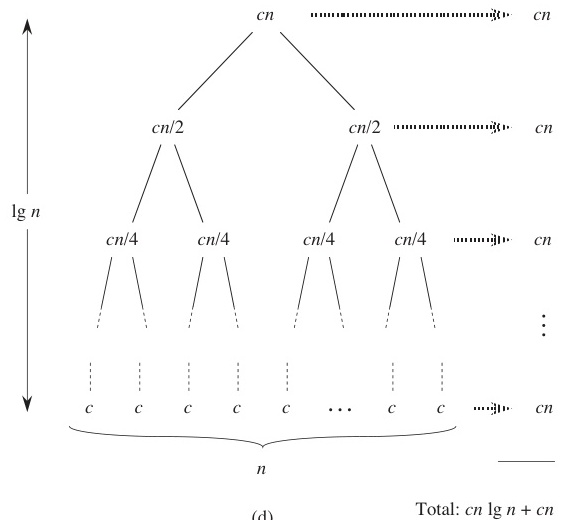

# Algorithms

Week 2 — Algorithm Design and Complexity Analysis

Korea University Sejong Campus, Dept. of Computer Science & Software

---
layout: section
---

# Part 1. Algorithm Fundamentals

---

# Review: What is an Algorithm?

- An **algorithm** is a step-by-step procedure or method for solving a problem
- The problems we consider are solved **using a computer**
- An algorithm takes **input** and produces **output** (a solution)

```
┌───────┐      ┌─────────────┐      ┌────────┐
│ Input │ ───► │  Algorithm  │ ───► │ Output │
└───────┘      └─────────────┘      └────────┘
```

---

# Properties of Algorithms

| Property | Description |
|----------|-------------|
| **Correctness** | Must produce the correct output for every valid input (same input → same output) |
| **Executability** | Each step must be executable on a computer |
| **Finiteness** | Must terminate within a finite amount of time |
| **Efficiency** | The more efficient (in time and space), the more valuable |

---

# Euclid's GCD Algorithm

- The **oldest known algorithm**, dating back to ~300 BC
- **Greatest Common Divisor (GCD)**: the largest number that divides two natural numbers
- Key insight: GCD(A, B) = GCD(B, A mod B)

<br>

**Mathematical basis:**

If $A > B$, $A = a \cdot G$, $B = b \cdot G$ (where $G$ = GCD), then:

$$A \mod B = (a \mod b) \cdot G$$

Repeatedly applying this reduces $B$ to $0$, at which point $A$ is the GCD.

---

# Euclid's GCD — Pseudocode

```
Euclid(a, b)
  Input:  integers a, b  where a >= b >= 0
  Output: GCD(a, b)

  if b == 0
      return a
  return Euclid(b, a mod b)
```

**Trace: GCD(24, 14)**

| Call | a | b | a mod b |
|------|---|---|---------|
| 1 | 24 | 14 | 10 |
| 2 | 14 | 10 | 4 |
| 3 | 10 | 4 | 2 |
| 4 | 4 | 2 | 0 |
| 5 | 2 | 0 | — (return 2) |

---

# GCD Implementation — Iteration vs Recursion

**Iterative version:**

```python
def gcd_iter(a, b):
    while b != 0:
        a, b = b, a % b
    return a
```

**Recursive version:**

```python
def gcd_rec(a, b):
    if b == 0:
        return a
    return gcd_rec(b, a % b)
```

- Both produce identical results
- Recursion uses the **call stack**; each call pushes a new frame
- Iteration avoids stack overhead

---

# Recursion and the Call Stack

```
gcd_rec(24, 14)
  └─► gcd_rec(14, 10)
        └─► gcd_rec(10, 4)
              └─► gcd_rec(4, 2)
                    └─► gcd_rec(2, 0) → returns 2
                  returns 2
            returns 2
      returns 2
returns 2
```

Each recursive call **pushes** a frame onto the stack. When `b == 0`, values **pop** back up.

---

# Algorithm Representation

An algorithm is a step-by-step procedure — similar to a recipe.

Three common ways to express an algorithm:

| Method | Description |
|--------|-------------|
| **Natural Language** | Plain verbal description of each step |
| **Pseudocode** | Structured, language-like notation (most common) |
| **Flowchart** | Visual diagram with shapes and arrows |

---

# Example: Find the Maximum — Natural Language

**Problem:** Given $n$ cards with numbers, find the largest number.

1. Read the first card's number and remember it
2. Read the next card and compare it with the remembered number
3. Keep the larger number in memory
4. If cards remain, go to step 2
5. The remembered number is the maximum

> Plain verbal description — easy to understand, but can be ambiguous.

---

# Example: Find the Maximum — Pseudocode

```
FindMax(A[], n)
  max = A[0]
  for i = 1 to n-1
      if A[i] > max
          max = A[i]
  return max
```

- Structured notation — precise and unambiguous
- The most common representation in algorithm textbooks

---

# Example: Find the Maximum — Flowchart

<div style="display: flex; align-items: center; gap: 40px;">
<pre style="font-size: 0.7em; line-height: 1.3;">
  ┌─────────┐
  │  Start  │
  └────┬────┘
       ▼
  ┌─────────┐
  │max=A[0] │
  │ i = 1   │
  └────┬────┘
       ▼
  ◇ i < n ? ◇──No──► ┌────────────┐
       │              │ return max │
      Yes             └────────────┘
       ▼
  ◇ A[i]>max? ◇
    │        │
   Yes      No
    ▼        │
┌────────┐   │
│max=A[i]│   │
└───┬────┘   │
    │◄───────┘
    ▼
┌────────┐
│i = i+1 │
└───┬────┘
    │
    └──► (back to i < n ?)
</pre>
<div>

- Visual diagram with **shapes and arrows**
- Intuitive for simple algorithms
- Becomes complex for large programs
- Less commonly used in modern textbooks

</div>
</div>

---
layout: section
---

# Algorithm Classification

Six major types based on problem-solving strategy

---

# Classification by Problem-Solving Strategy

| Type | Core Idea |
|------|-----------|
| **Divide and Conquer** | Split into subproblems → solve each → combine results |
| **Greedy** | Make the locally optimal choice at each step |
| **Dynamic Programming** | Solve subproblems, store results, reuse them |
| **Approximation** | Find near-optimal solutions for NP-hard problems |
| **Backtracking** | Explore all possibilities, prune infeasible branches |
| **Branch and Bound** | Like backtracking, but use bounds to prune more aggressively |

---

# Divide and Conquer

**Idea:** Break a large problem into smaller subproblems, solve each recursively, then combine.

**Examples:** Merge Sort, Quick Sort, Binary Search

```
          Problem(n)
         /          \
   Sub(n/2)      Sub(n/2)
     /  \          /  \
  S(n/4) S(n/4) S(n/4) S(n/4)
```

**Strengths:** Effective when the problem structure is naturally recursive.

---

# Greedy Algorithms

**Idea:** At each step, choose the option that looks best **right now**.

- Does **not** always guarantee a globally optimal solution
- But under certain conditions (greedy-choice property + optimal substructure), it does

**Examples:**
- Minimum Spanning Tree (Kruskal's, Prim's)
- Dijkstra's Shortest Path
- Huffman Coding

---

# Dynamic Programming (DP)

**Idea:** Break the problem into subproblems (like DaC), but **store** and **reuse** overlapping subproblem results.

**Key conditions:**
- Overlapping subproblems
- Optimal substructure

**Examples:**
- Fibonacci sequence
- Longest Common Subsequence (LCS)
- Knapsack problem

**DP vs Divide and Conquer:** DaC subproblems are independent; DP subproblems overlap.

---

# Approximation, Backtracking, Branch-and-Bound

**Approximation Algorithms**
- For NP-hard problems where exact solutions are too expensive
- Trade optimality for speed; analyze the **approximation ratio**
- *Examples:* TSP approximation, Vertex Cover

**Backtracking**
- Exhaustive search with **pruning** of infeasible branches
- *Examples:* N-Queens, maze solving, permutation generation

**Branch and Bound**
- Like backtracking but computes **upper/lower bounds** to prune more effectively
- Used for optimization versions of NP-hard problems
- *Examples:* TSP (exact), Knapsack (exact)

---

# Other Classifications

**By problem domain:**
- Sorting algorithms
- Graph algorithms
- Computational geometry

**By computing environment:**
- Parallel algorithms
- Distributed algorithms
- Quantum algorithms

**Other:**
- Artificial intelligence / Machine learning algorithms

---
layout: section
---

# Time Complexity

Measuring algorithm efficiency

---

# What is Time Complexity?

- **Time complexity** expresses the number of **elementary operations** as a function of input size $n$
- **Elementary operations**: comparisons, reads, writes, arithmetic — simple constant-time operations

<br>

**Example: Finding the maximum in $n$ cards**

- Sequential scan: compare each card with the current max
- Number of comparisons: $n - 1$
- Time complexity: $T(n) = n - 1$

---

# Running Time Examples

**Example 1 — O(1):**

```
sample1(A[], n)
    k = n / 2
    return A[k]
```

One division + one array access → **constant time** regardless of $n$.

---

# Running Time Examples

**Example 2 — O(n):**

```
sample2(A[], n)
    sum = 0
    for i = 1 to n
        sum = sum + A[i]
    return sum
```

The loop runs $n$ times → **linear time**.

---

# Running Time Examples

**Example 3 — O(n^2):**

```
sample3(A[], n)
    sum = 0
    for i = 1 to n
        for j = 1 to n
            sum = sum + A[i] * A[j]
    return sum
```

Nested loops, each running $n$ times → $n \times n$ = **quadratic time**.

---

# Running Time Examples

**Example 4 — O(n^2) (triangular loop):**

```
sample5(A[], n)
    sum = 0
    for i = 1 to n-1
        for j = i+1 to n
            sum = sum + A[i] * A[j]
    return sum
```

Inner loop runs $(n-1) + (n-2) + \cdots + 1 = \frac{n(n-1)}{2}$ times → still $O(n^2)$.

---

# Running Time Examples

**Example 5 — O(n) (recursion):**

```
factorial(n)
    if n == 1 return 1
    return n * factorial(n - 1)
```

Recursion depth is $n$ → **linear time**.

---

# Types of Complexity Analysis

| Type | Meaning |
|------|---------|
| **Worst-case** | Upper bound — "no matter what input, it won't exceed this" |
| **Average-case** | Expected time under a probability distribution (usually uniform) |
| **Best-case** | Fastest possible execution — used to find optimal algorithms |
| **Amortized** | Average cost per operation over a sequence of operations |

In practice, **worst-case analysis** is the most commonly used.

---

# Commute Time Analogy

<div style="display: flex; align-items: center; gap: 24px;">
<div style="flex: 1;">

**Scenario:** Home → Station (6 min) → Subway (20 min) → Classroom (10 min)

| Case | Time | Explanation |
|------|------|-------------|
| **Best** | 36 min | Train is there immediately |
| **Worst** | 40 min | Just missed it, wait 4 min |
| **Average** | 38 min | Average wait ~2 min |

This is how we think about algorithm analysis — the **worst case** gives us a guarantee.

</div>
<div style="flex-shrink: 0;">
  
</div>
</div>

---
layout: section
---

# Part 2. Asymptotic Notation

---

# Why Asymptotic Notation?

- Time complexity is a function of $n$ (usually a polynomial with multiple terms)
- As $n$ grows large, only the **dominant term** matters
- **Asymptotic notation** simplifies the expression by focusing on growth rate

<br>

Three main notations:

| Notation | Meaning | Intuition |
|----------|---------|-----------|
| $O$ (Big-O) | Upper bound | Worst case — "at most this fast" |
| $\Omega$ (Big-Omega) | Lower bound | Best case — "at least this fast" |
| $\Theta$ (Theta) | Tight bound | Exact growth rate |

---

# Big-O Notation — Formal Definition

$O(g(n))$ = the set of functions that grow **at most as fast as** $g(n)$.

$$O(g(n)) = \{ f(n) \mid \exists\, c > 0,\; n_0 \geq 0 \;\text{s.t.}\; \forall\, n \geq n_0,\; f(n) \leq c \cdot g(n) \}$$

- $g(n)$ is the **asymptotic upper bound** of $f(n)$
- Convention: we write $f(n) = O(g(n))$ even though technically $f(n) \in O(g(n))$

**Intuitive meaning:**

$f(n) = O(g(n))$ means $f$ does **not grow faster** than $g$ (ignoring constant factors).

---

# Big-O — Example Proof

**Prove:** $f(n) = 2n^2 - 8n + 3 = O(n^2)$

We need to find constants $c > 0$ and $n_0 \geq 0$ such that $2n^2 - 8n + 3 \leq c \cdot n^2$ for all $n \geq n_0$.

Choose $c = 5$:

$$2n^2 - 8n + 3 \leq 5n^2 \quad \text{for all } n \geq 1$$

This simplifies to $-3n^2 - 8n + 3 \leq 0$, which is true for $n \geq 1$.

Therefore, with $c = 5$ and $n_0 = 1$, we have $f(n) = O(n^2)$. $\square$

---

# Members of O(n^2)

**Functions in $O(n^2)$:**
- $3n^2 + 2n$ ✓
- $7n^2 - 100n$ ✓
- $n \log n + 5n$ ✓
- $3n$ ✓

**Functions NOT in $O(n^2)$:**
- $n^3$ ✗
- $3^n$ ✗

**Best practice:** Be as **tight** as possible.
- $n \log n + 5n = O(n \log n)$ — do not write $O(n^2)$ even though technically correct
- A looser bound means **loss of information**

---

# More Big-O Examples

| Expression | Big-O | Why |
|-----------|-------|-----|
| $3n + 2$ | $O(n)$ | $3n+2 \leq 4n$ for $n \geq 2$ |
| $100n + 6$ | $O(n)$ | $100n+6 \leq 101n$ for $n \geq 10$ |
| $10n^2 + 4n + 2$ | $O(n^2)$ | $10n^2+4n+2 \leq 11n^2$ for $n \geq 5$ |
| $6 \cdot 2^n + n^2$ | $O(2^n)$ | $6 \cdot 2^n + n^2 \leq 7 \cdot 2^n$ for $n \geq 4$ |

---

# Big-Omega Notation — Formal Definition

$\Omega(g(n))$ = the set of functions that grow **at least as fast as** $g(n)$.

$$\Omega(g(n)) = \{ f(n) \mid \exists\, c > 0,\; n_0 \geq 0 \;\text{s.t.}\; \forall\, n \geq n_0,\; f(n) \geq c \cdot g(n) \}$$

- $g(n)$ is the **asymptotic lower bound** of $f(n)$
- Symmetric to Big-O

**Intuitive meaning:**

$f(n) = \Omega(g(n))$ means $f$ does **not grow slower** than $g$.

---

# Big-Omega — Examples

| Expression | Big-Omega | Why |
|-----------|-----------|-----|
| $3n + 2$ | $\Omega(n)$ | $3n+2 \geq 3n$ for $n \geq 1$ |
| $100n + 6$ | $\Omega(n)$ | $100n+6 \geq 100n$ for $n \geq 1$ |
| $10n^2 + 4n + 2$ | $\Omega(n^2)$ | $10n^2+4n+2 \geq n^2$ for $n \geq 1$ |
| $6 \cdot 2^n + n^2$ | $\Omega(2^n)$ | $6 \cdot 2^n + n^2 \geq 2^n$ for $n \geq 1$ |

**Best practice:** Be as tight as possible.
- $n \log n + 5n = \Omega(n \log n)$ — don't write $\Omega(n)$

---

# Theta Notation — Formal Definition

$\Theta(g(n))$ = the set of functions that grow **at the same rate as** $g(n)$.

$$\Theta(g(n)) = O(g(n)) \;\cap\; \Omega(g(n))$$

$$\Theta(g(n)) = \{ f(n) \mid \exists\, c_1, c_2 > 0,\; n_0 \geq 0 \;\text{s.t.}\; \forall\, n \geq n_0,\; c_2 \cdot g(n) \leq f(n) \leq c_1 \cdot g(n) \}$$

**Intuitive meaning:**

$f(n) = \Theta(g(n))$ means $f$ and $g$ grow at the **same rate** (up to constant factors).

---

# Theta — Examples

| Expression | Theta |
|-----------|-------|
| $3n + 2$ | $\Theta(n)$ — since $3n \leq 3n+2 \leq 4n$ for $n \geq 2$ |
| $10n^2 + 4n + 2$ | $\Theta(n^2)$ |
| $6 \cdot 2^n + n^2$ | $\Theta(2^n)$ |

**Non-examples:**

$2n^2 + 3n + 5 \neq \Theta(n^3)$ and $2n^2 + 3n + 5 \neq \Theta(n)$

Theta requires **both** upper and lower bounds to match.

---

# Common Complexity Classes

| Notation | Name | Example |
|----------|------|---------|
| $O(1)$ | Constant | Array index access |
| $O(\log n)$ | Logarithmic | Binary search |
| $O(n)$ | Linear | Linear search |
| $O(n \log n)$ | Log-linear | Merge sort |
| $O(n^2)$ | Quadratic | Bubble sort |
| $O(n^3)$ | Cubic | Matrix multiplication (naive) |
| $O(2^n)$ | Exponential | Brute-force subsets |

**Hierarchy:** $O(1) \subset O(\log n) \subset O(n) \subset O(n \log n) \subset O(n^2) \subset O(n^3) \subset O(2^n)$

---

# Growth Rate Comparison

| $n$ | $\log n$ | $n$ | $n \log n$ | $n^2$ | $n^3$ | $2^n$ |
|-----|----------|-----|-----------|-------|-------|-------|
| 10 | 3.3 | 10 | 33 | 100 | 1,000 | 1,024 |
| 100 | 6.6 | 100 | 664 | 10,000 | $10^6$ | $10^{30}$ |
| 1,000 | 10 | 1,000 | 10,000 | $10^6$ | $10^9$ | $10^{301}$ |
| $10^6$ | 20 | $10^6$ | $2 \times 10^7$ | $10^{12}$ | $10^{18}$ | — |

The gap between polynomial and exponential is **enormous**.

---

# Why Efficient Algorithms Matter

**Sorting 1 billion numbers:**

| Algorithm | $n$ = 1,000 | $n$ = 1,000,000 | $n$ = 1,000,000,000 |
|-----------|-------------|-----------------|---------------------|
| $O(n^2)$ on PC | < 1 sec | ~2 hours | **~300 years** |
| $O(n^2)$ on supercomputer | < 1 sec | ~1 sec | ~1 week |
| $O(n \log n)$ on PC | < 1 sec | < 1 sec | **~5 minutes** |
| $O(n \log n)$ on supercomputer | < 1 sec | < 1 sec | < 1 sec |

> An efficient algorithm is **more valuable than a supercomputer**.
>
> Investing in better algorithms is far more economical than investing in better hardware.

---
layout: section
---

# Recurrence Relations

---

# What is a Recurrence Relation?

A **recurrence relation** expresses a function in terms of its value on **smaller inputs**.

**Examples:**

- $a_n = a_{n-1} + 2$
- $f(n) = n \cdot f(n-1)$ — factorial
- $f(n) = f(n-1) + f(n-2)$ — Fibonacci
- $f(n) = f(n/2) + n$ — binary reduction

**Why it matters:** Many recursive algorithms naturally produce recurrence relations for their running time.

---

# Merge Sort Recurrence

**Merge Sort** splits the array in half, sorts each half, then merges.

$$T(n) = 2T(n/2) + n$$

- $2T(n/2)$: two recursive calls on halves
- $n$: merging overhead (linear scan)
- $T(1) = 1$

---

# Three Methods for Solving Recurrences

| Method | Idea |
|--------|------|
| **Repeated Substitution** | Expand the recurrence step by step until a pattern emerges |
| **Guess and Verify** | Guess the form, then prove by mathematical induction |
| **Master Theorem** | Apply a formula directly to recurrences of a specific form |

---

# Method 1: Repeated Substitution

**Example:** $T(n) = T(n-1) + c$, $T(1) \leq c$

$$
\begin{aligned}
T(n) &= T(n-1) + c \\
     &= (T(n-2) + c) + c = T(n-2) + 2c \\
     &= T(n-3) + 3c \\
     &\;\;\vdots \\
     &= T(1) + (n-1)c \\
     &\leq c + (n-1)c = cn = O(n)
\end{aligned}
$$

This is the recurrence for **factorial** — linear time.

---

# Repeated Substitution — Merge Sort

**Recurrence:** $T(n) = 2T(n/2) + n$, $T(1) = 1$

Assume $n = 2^k$:

$$
\begin{aligned}
T(n) &= 2T(n/2) + n \\
     &= 2(2T(n/4) + n/2) + n = 4T(n/4) + 2n \\
     &= 8T(n/8) + 3n \\
     &\;\;\vdots \\
     &= 2^k T(n/2^k) + kn \\
     &= n \cdot T(1) + n \log_2 n \\
     &= n + n \log n = O(n \log n)
\end{aligned}
$$

---

# Method 2: Guess and Verify (Induction)

**Recurrence:** $T(n) = 2T(n/2) + n$

**Guess:** $T(n) = O(n \log n)$, i.e., $T(n) \leq cn \log n$ for some constant $c > 0$.

**Proof by induction:**

*Base case:* $T(2) \leq c \cdot 2 \log 2$ — holds for sufficiently large $c$.

*Inductive hypothesis:* Assume $T(n/2) \leq c(n/2)\log(n/2)$.

*Inductive step:*

$$
\begin{aligned}
T(n) &= 2T(n/2) + n \\
     &\leq 2 \cdot c(n/2)\log(n/2) + n \\
     &= cn\log n - cn\log 2 + n \\
     &= cn\log n + (-c\log 2 + 1)n \\
     &\leq cn\log n \quad \text{(when } c \geq 1/\log 2\text{)}
\end{aligned}
$$

Therefore $T(n) = O(n \log n)$. $\square$

---

# Guess and Verify — Common Pitfall

**Caution:** The constant $c$ in the hypothesis must be the **same** $c$ in the conclusion.

**Wrong proof attempt for** $T(n) = 2T(n/2) + 1$, guess $T(n) = O(n)$:

$$T(n) \leq 2 \cdot c(n/2) + 1 = cn + 1$$

This is $cn + 1$, **not** $\leq cn$. The proof fails!

**Fix:** Strengthen the guess to $T(n) \leq cn - 2$:

$$T(n) \leq 2(c(n/2) - 2) + 1 = cn - 4 + 1 = cn - 3 \leq cn - 2 \;\checkmark$$

---
layout: section
---

# Master Theorem

---

# Master Theorem — Statement

For recurrences of the form:

$$T(n) = aT(n/b) + f(n) \quad \text{where } a \geq 1, \; b > 1$$

Let $h(n) = n^{\log_b a}$. Compare $f(n)$ with $h(n)$:

| Case | Condition | Result |
|------|-----------|--------|
| **Case 1** | $f(n) = O(n^{\log_b a - \varepsilon})$ for some $\varepsilon > 0$ | $T(n) = \Theta(n^{\log_b a})$ |
| **Case 2** | $f(n) = \Theta(n^{\log_b a})$ | $T(n) = \Theta(n^{\log_b a} \log n)$ |
| **Case 3** | $f(n) = \Omega(n^{\log_b a + \varepsilon})$ for some $\varepsilon > 0$, and $af(n/b) \leq cf(n)$ for some $c < 1$ | $T(n) = \Theta(f(n))$ |

---

# Master Theorem — Intuition

<div style="display: flex; align-items: flex-start; gap: 24px;">
<div style="flex: 1;">

$$T(n) = aT(n/b) + f(n)$$

Each level of the recursion tree does work. **Who dominates?**

| Scenario | Winner | Result |
|----------|--------|--------|
| Leaves dominate | Leaf work wins | $T(n) = \Theta(n^{\log_b a})$ |
| Root dominates | Root work wins | $T(n) = \Theta(f(n))$ |
| Balanced | Equal per level | $T(n) = \Theta(n^{\log_b a} \log n)$ |

The tree has height $\log_b n$, and each level's total cost sums to the right.

</div>
<div style="flex-shrink: 0;">
  
</div>
</div>

---

# Master Theorem — Examples

**Example 1:** $T(n) = 2T(n/3) + c$

- $a = 2$, $b = 3$, $h(n) = n^{\log_3 2} \approx n^{0.63}$, $f(n) = c = O(1)$
- $f(n)$ is polynomially smaller → **Case 1**
- $T(n) = \Theta(n^{\log_3 2})$

**Example 2:** $T(n) = 2T(n/4) + n$

- $a = 2$, $b = 4$, $h(n) = n^{\log_4 2} = n^{0.5} = \sqrt{n}$, $f(n) = n$
- $f(n)$ is polynomially larger → **Case 3**
- $T(n) = \Theta(n)$

**Example 3:** $T(n) = 2T(n/2) + n$

- $a = 2$, $b = 2$, $h(n) = n^{\log_2 2} = n$, $f(n) = n$
- $f(n) = \Theta(h(n))$ → **Case 2**
- $T(n) = \Theta(n \log n)$

---

# Summary

- **Algorithm** = step-by-step problem-solving procedure (correctness, executability, finiteness, efficiency)
- **Representation**: pseudocode is the standard; also natural language and flowcharts
- **Classification**: DaC, Greedy, DP, Approximation, Backtracking, Branch-and-Bound
- **Time Complexity**: count elementary operations as a function of input size $n$
- **Asymptotic Notation**: $O$ (upper bound), $\Omega$ (lower bound), $\Theta$ (tight bound)
- **Recurrence Relations**: repeated substitution, guess-and-verify, Master Theorem
- **Textbook**: CLRS Chapters 1–3

---

# Homework

- **Assignment 1** is posted — check LMS for details
- No quiz this week; quizzes begin **Week 03**
- Next week: **Arrays, Sorting Algorithms** — elementary and advanced sorts

---

# Q & A

codingchild@korea.ac.kr
