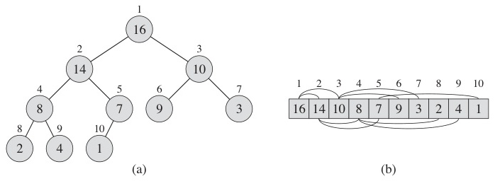
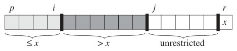
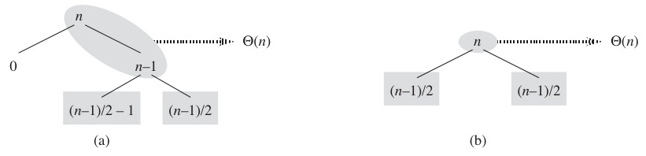
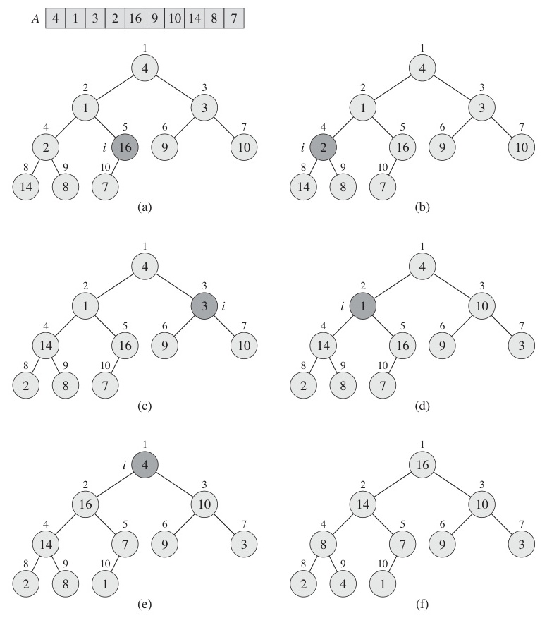
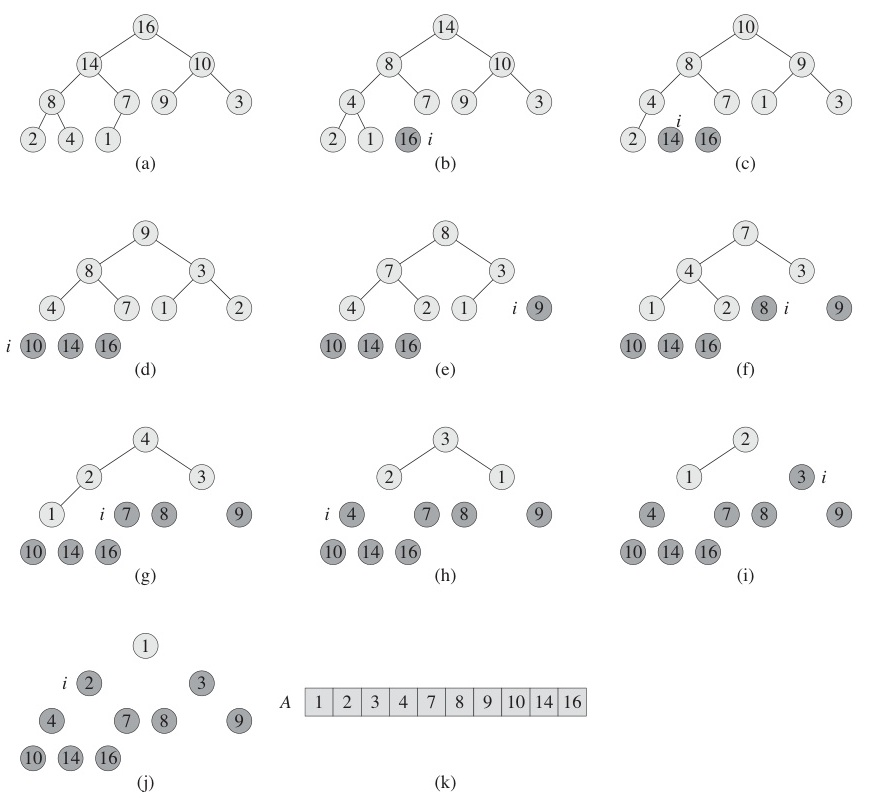

# Algorithms

Week 3 — Arrays, Stacks, Queues, and Basic Sorting Algorithms

Korea University Sejong Campus, Dept. of Computer Science & Software

---
layout: section
---

# Part 1. Fundamental Data Structures and Elementary Sorting

---

# Learning Objectives

- Review fundamental data structures: list, stack, queue, heap
- Understand elementary sorting algorithms and their O(n^2) behavior
- Understand advanced sorting algorithms and their O(n log n) behavior
- Understand linear-time sorting and the conditions that enable it
- Grasp the **recursive (inductive) structure** of sorting algorithms
- Compare sorting algorithm complexities

---

# Linked List

<div style="display: flex; align-items: flex-start; gap: 24px;">
<div style="flex: 1;">

- A sequence of **nodes**, each containing data and a pointer to the next node

```c
typedef int element;

typedef struct ListNode {
    element data;
    struct ListNode *link;
} ListNode;
```

- Operations: insert, delete, search — all O(n) in the worst case
- Visualization: [https://visualgo.net/en/list](https://visualgo.net/en/list)

</div>
<div style="flex-shrink: 0;">
  
</div>
</div>

---

# Stack

<div style="display: flex; align-items: flex-start; gap: 24px;">
<div style="flex: 1;">

- **LIFO** (Last In, First Out)
- `push()`: add element to the top
- `pop()`: remove element from the top
- Applications: function call stack, expression evaluation, backtracking
- Visualization: [https://visualgo.net/en/list](https://visualgo.net/en/list)

</div>
<div style="flex-shrink: 0;">
  
</div>
</div>

---

# Queue

<div style="display: flex; align-items: flex-start; gap: 24px;">
<div style="flex: 1;">

- **FIFO** (First In, First Out)
- `enqueue()`: add element to the rear
- `dequeue()`: remove element from the front
- Applications: BFS, scheduling, buffering
- Visualization: [https://visualgo.net/en/list](https://visualgo.net/en/list)

</div>
<div style="flex-shrink: 0;">
  
</div>
</div>

---

# Heap

<div style="display: flex; align-items: flex-start; gap: 24px;">
<div style="flex: 1;">

- A **complete binary tree** satisfying the heap property
  - **Max Heap**: key(parent) >= key(child)
  - **Min Heap**: key(parent) <= key(child)
- Heaps are stored as **arrays** (no pointers needed)
  - A[i]'s children: **A[2i]**, **A[2i+1]**
  - A[i]'s parent: **A[floor(i/2)]**
- Applications: priority queues, heap sort
- Visualization: [visualgo.net/en/heap](https://visualgo.net/en/heap)

</div>
<div style="flex-shrink: 0;">
  
</div>
</div>

---

# Sorting Algorithms — Landscape

- Most sorting algorithms fall between **O(n^2)** and **O(n log n)**
- When input has special properties, **O(n)** sorting is possible

| Category | Algorithms | Complexity |
|----------|-----------|------------|
| Elementary | Selection, Bubble, Insertion | O(n^2) |
| Advanced | Merge, Quick, Heap | O(n log n) |
| Linear-time | Radix, Counting | O(n) |

> Two perspectives on algorithms:
> - **Flow-based**: follow the execution step by step
> - **Relational**: observe how each step transforms the state (deeper understanding)

---
layout: section
---

# Elementary Sorting — O(n^2)

Selection Sort, Bubble Sort, Insertion Sort

---

# Selection Sort — Idea

<div style="display: flex; align-items: flex-start; gap: 24px;">
<div style="flex: 1;">

For each iteration:
1. **Find** the minimum element in the unsorted portion
2. **Swap** it with the leftmost element of the unsorted portion
3. **Exclude** that element (it is now in its final position)
4. Repeat until one element remains

- Selects the **minimum** (or maximum) each round

</div>
</div>

---

# Selection Sort — Step-by-Step

<div style="display: grid; grid-template-columns: 1fr 1fr; gap: 8px; max-height: 440px; overflow: hidden;">
  <div><p style="font-size:0.65em; text-align:center; margin:2px 0;">Step 0: initial unsorted array</p></div>
  <div><p style="font-size:0.65em; text-align:center; margin:2px 0;">Step 1: min at front, sorted portion grows</p></div>
  <div><p style="font-size:0.65em; text-align:center; margin:2px 0;">Step 2: continue scanning unsorted</p></div>
  <div><p style="font-size:0.65em; text-align:center; margin:2px 0;">Step 3: final — array sorted</p></div>
</div>

> Animation: [https://visualgo.net/en/sorting](https://visualgo.net/en/sorting)

---

# Selection Sort — Pseudocode & Complexity

```
selectionSort(A[], n)          ▷ Sort A[1...n]
{
    for last ← n downto 2 {                          ── ①
        Find the largest element A[k] in A[1...last]; ── ②
        A[k] ↔ A[last];   ▷ swap A[k] and A[last]   ── ③
    }
}
```

**Complexity Analysis:**
- Loop ① runs **n - 1** times
- Finding the max ② requires: n-1, n-2, ..., 2, 1 comparisons
- Swap ③ is constant time

$$T(n) = (n-1) + (n-2) + \cdots + 2 + 1 = \frac{n(n-1)}{2} = \Theta(n^2)$$

- **Worst case**: Theta(n^2) | **Average case**: Theta(n^2)

---

# Bubble Sort — Idea

<div style="display: flex; align-items: flex-start; gap: 24px;">
<div style="flex: 1;">

For each iteration:
1. Starting from the left, compare **adjacent pairs**
2. If they are out of order, **swap** them
3. The largest element "**bubbles up**" to the rightmost position
4. Exclude the rightmost element and repeat

- Bubbles the **maximum** to the end each round

</div>
</div>

---

# Bubble Sort — Step-by-Step

<div style="display: grid; grid-template-columns: 1fr 1fr; gap: 8px; max-height: 440px; overflow: hidden;">
  <div><p style="font-size:0.65em; text-align:center; margin:2px 0;">Pass 0: initial array, begin comparing adjacent pairs</p></div>
  <div><p style="font-size:0.65em; text-align:center; margin:2px 0;">Pass 1: fewer comparisons needed</p></div>
  <div><p style="font-size:0.65em; text-align:center; margin:2px 0;">Pass 2: sorted portion grows from right</p></div>
  <div><p style="font-size:0.65em; text-align:center; margin:2px 0;">Pass 3: array fully sorted</p></div>
</div>

> Animation: [https://visualgo.net/en/sorting](https://visualgo.net/en/sorting)

---

# Bubble Sort — Pseudocode & Complexity

```
bubbleSort(A[], n)             ▷ Sort A[1...n]
{
    for last ← n downto 2                                  ── ①
        for i ← 1 to last-1                                ── ②
            if (A[i] > A[i+1]) then A[i] ↔ A[i+1];        ── ③
}
```

**Complexity Analysis:**
- Loop ① runs **n - 1** times
- Loop ② runs n-1, n-2, ..., 2, 1 times respectively
- Swap ③ is constant time

$$T(n) = (n-1) + (n-2) + \cdots + 2 + 1 = \frac{n(n-1)}{2} = \Theta(n^2)$$

- **Worst case**: Theta(n^2) | **Average case**: Theta(n^2)

---

# Insertion Sort — Idea

<div style="display: flex; align-items: flex-start; gap: 24px;">
<div style="flex: 1;">

For each iteration:
1. Take the next element (**key**) from the unsorted portion
2. **Shift** elements in the sorted portion that are larger
3. **Insert** the key into its correct position

- Like sorting a hand of playing cards — pick one card at a time and insert it in order

</div>
<div style="flex-shrink: 0;">
  
</div>
</div>

---

# Insertion Sort — Step-by-Step

<div style="display: grid; grid-template-columns: 1fr 1fr; gap: 12px;">
  <div><p style="font-size:0.7em; text-align:center;">Step 0: key=5, shift 9 right, insert 5</p></div>
  <div><p style="font-size:0.7em; text-align:center;">Step 1: key=1, shift 9,5 right, insert 1</p></div>
  <div><p style="font-size:0.7em; text-align:center;">Step 2: key=4, shift 9,5 right, insert 4</p></div>
  <div><p style="font-size:0.7em; text-align:center;">Step 3: key=3, shift 9,5,4 right — sorted!</p></div>
</div>

---

# Insertion Sort — Pseudocode & Complexity

```
insertionSort(A[], n)          ▷ Sort A[1...n]
{
    for i ← 2 to n                                         ── ①
        Insert A[i] into its proper place in A[1...i];      ── ②
}
```

| Case | Comparisons | Complexity |
|------|------------|------------|
| **Worst** (reverse sorted) | 1 + 2 + ... + (n-1) | Theta(n^2) |
| **Average** | 1/2 (1 + 2 + ... + (n-1)) | Theta(n^2) |
| **Best** (already sorted) | 1 + 1 + ... + 1 | **Theta(n)** |

> Insertion sort is the **fastest** elementary sort on nearly-sorted data.

---

# Insertion Sort — Inductive Proof of Correctness

**Loop Invariant**: At the start of iteration i, the subarray A[1...i-1] is sorted.

- **Base case** (n = 1): A single element A[1] is trivially sorted.
- **Inductive step**: If A[1...k] is sorted (P(k) holds), then inserting A[k+1] into its correct position yields a sorted A[1...k+1] (P(k+1) holds).
- **Conclusion**: After iteration n, the entire array A[1...n] is sorted.

> This is exactly **mathematical induction** from high school — applied to algorithms.

---

# Recursive Structure of Elementary Sorts

All three elementary sorts have the **same recursive structure**:

```
T(n) = T(n-1) + Theta(n)
```

| Algorithm | Recursive Form | "Work per level" |
|-----------|---------------|------------------|
| **Insertion Sort** | Sort A[1...n-1], then insert A[n] | insert(n) = Theta(n) |
| **Selection Sort** | Find max and swap, then sort A[1...n-1] | maxSwap(n) = Theta(n) |
| **Bubble Sort** | Bubble max to end, then sort A[1...n-1] | bubble(n) = Theta(n) |

```
insertionSort(A, n) {       selectionSort(A, n) {       bubbleSort(A, n) {
  if (n == 1) return;         if (n == 1) return;         if (n == 1) return;
  insertionSort(A, n-1);      maxSwap(A, n);              bubble(A, n);
  insert(A, n);                selectionSort(A, n-1);      bubbleSort(A, n-1);
}                            }                           }
```

> Key difference: Insertion sort does its work **after** the recursive call; Selection and Bubble sort do their work **before**.

---
layout: section
---

# Part 2. Advanced Sorting — O(n log n)

Merge Sort, Quick Sort, Heap Sort

---

# Merge Sort — Idea

<div style="display: flex; align-items: flex-start; gap: 24px;">
<div style="flex: 1;">

**Divide and Conquer**:
1. **Divide**: Split the array into two halves
2. **Conquer**: Recursively sort each half
3. **Combine**: Merge the two sorted halves

</div>
<div style="flex-shrink: 0;">
  
</div>
</div>

---

# Merge Sort — Pseudocode

```
mergeSort(A[], p, r)           ▷ Sort A[p...r]
{
    if (p < r) then {
        q ← floor((p + r) / 2);       ▷ midpoint
        mergeSort(A, p, q);            ▷ sort left half
        mergeSort(A, q+1, r);          ▷ sort right half
        merge(A, p, q, r);            ▷ merge two sorted halves
    }
}
```

```
merge(A[], p, q, r)            ▷ Merge A[p...q] and A[q+1...r]
{
    i ← p; j ← q+1; t ← 1;
    while (i ≤ q and j ≤ r) {
        if (A[i] ≤ A[j])
            tmp[t++] ← A[i++];
        else
            tmp[t++] ← A[j++];
    }
    Copy remaining elements to tmp[];
    Copy tmp[] back to A[p...r];
}
```

---

# Merge Sort — Merge Procedure Example

Merge `[3, 8, 31, 65, 73]` and `[11, 15, 20, 29, 48]`:

```
 i                       j
[3, 8, 31, 65, 73]     [11, 15, 20, 29, 48]     tmp = []

Step 1: 3 < 11  → tmp = [3],        i moves right
Step 2: 8 < 11  → tmp = [3, 8],     i moves right
Step 3: 31 > 11 → tmp = [3, 8, 11], j moves right
Step 4: 31 > 15 → tmp = [3, 8, 11, 15], j moves right
Step 5: 31 > 20 → tmp = [3, 8, 11, 15, 20], j moves right
Step 6: 31 > 29 → tmp = [3, 8, 11, 15, 20, 29], j moves right
Step 7: 31 < 48 → tmp = [3, 8, 11, 15, 20, 29, 31], i moves right
Step 8: 65 > 48 → tmp = [3, 8, 11, 15, 20, 29, 31, 48], j moves right
Step 9-10: Copy remaining [65, 73]

Result: [3, 8, 11, 15, 20, 29, 31, 48, 65, 73]
```

---

# Merge Sort — Complexity Analysis

**Recurrence**:

$$T(n) = 2T\left(\frac{n}{2}\right) + \Theta(n)$$

**Recursion tree**: each level does Theta(n) total work, and there are log2(n) levels.

```
Level 0:         n                    → n work
Level 1:     n/2   n/2               → n work
Level 2:   n/4 n/4 n/4 n/4           → n work
  ...
Level h:   1  1  1  ...  1           → n work

h = log₂n  levels  →  Total: n × log₂n
```

$$T(n) = \Theta(n \log n)$$

> Merge sort is **always** Theta(n log n) — worst, average, and best case.
> Trade-off: requires **O(n) extra space** for the temporary array.

---

# Quick Sort — Idea

1. Choose a **pivot** element (e.g., the last element)
2. **Partition**: rearrange so that elements < pivot are on the left, elements > pivot are on the right
3. The pivot is now in its **final sorted position**
4. Recursively sort the left and right subarrays

```text
[31, 8, 48, 73, 11, 3, 20, 29, 65, 15]   pivot = 15

[8, 11, 3, |15|, 31, 48, 20, 29, 65, 73]  After partition

[3, 8, 11, |15|, 20, 29, 31, 48, 65, 73]  Recursively sort left & right
```

---

# Quick Sort — Pseudocode

```
quickSort(A[], p, r)           ▷ Sort A[p...r]
{
    if (p < r) then {
        q ← partition(A, p, r);    ▷ partition around pivot
        quickSort(A, p, q-1);      ▷ sort left subarray
        quickSort(A, q+1, r);      ▷ sort right subarray
    }
}
```

```
partition(A[], p, r)
{
    pivot ← A[r];                  ▷ choose last element as pivot
    i ← p - 1;
    for j ← p to r-1 {
        if (A[j] ≤ pivot) {
            i ← i + 1;
            A[i] ↔ A[j];
        }
    }
    A[i+1] ↔ A[r];                ▷ place pivot in final position
    return i + 1;
}
```

> `i` marks the boundary: everything at or below index `i` is <= pivot.
> `j` scans through the array from left to right.



---

# Quick Sort — Partition Example

<div style="display: flex; align-items: flex-start; gap: 20px;">
<div style="flex: 1;">

Partition `[31, 8, 48, 73, 11, 3, 20, 29, 65, 15]` with pivot = 15:

<pre style="font-size: 0.7em; line-height: 1.3;">
pivot = A[10] = 15,  i = 0

j=1: A[1]=31 > 15  → skip
j=2: A[2]=8  ≤ 15  → i=1, swap A[1]↔A[2]
j=3: A[3]=48 > 15  → skip
j=4: A[4]=73 > 15  → skip
j=5: A[5]=11 ≤ 15  → i=2, swap A[2]↔A[5]
j=6: A[6]=3  ≤ 15  → i=3, swap A[3]↔A[6]
j=7~9: > 15  → skip

Final: swap A[4]↔A[10]
→ [8, 11, 3, |15|, 31, 48, 20, 29, 65, 73]
</pre>

> Animation: [visualgo.net/en/sorting](https://visualgo.net/en/sorting)

</div>
<div style="flex-shrink: 0;">
  
</div>
</div>

---

# Quick Sort — Complexity Analysis

**Recurrence**: T(n) = T(i - 1) + T(n - i) + Theta(n), where i is the pivot's final position.

| Case | Partition Balance | Recurrence | Complexity |
|------|------------------|------------|------------|
| **Worst** | 0 : n-1 (sorted input) | T(n) = T(n-1) + Theta(n) | **Theta(n^2)** |
| **Best** | n/2 : n/2 (perfect split) | T(n) = 2T(n/2) + Theta(n) | **Theta(n log n)** |
| **Average** | random partition | See below | **Theta(n log n)** |

<div style="display: flex; align-items: flex-start; gap: 20px;">
<div style="flex: 1;">

**Worst case** — Input already sorted, pivot always min or max:
```
T(n) = T(0) + T(n-1) + Θ(n) = T(n-1) + Θ(n)
     = Θ(n) + Θ(n-1) + ... + Θ(1) = Θ(n²)
```

</div>
<div style="flex-shrink: 0;">
  
</div>
</div>

---

# Quick Sort — Why Average Case is O(n log n)

<div style="display: flex; align-items: flex-start; gap: 20px;">
<div style="flex: 1;">

**Key insight**: As long as the partition ratio is **any constant fraction** (even 1:9 or 1:99), the depth remains O(log n).

- The longest path: n → 9n/10 → (9/10)²n → ... → 1
- Depth = log_{10/9}(n) = O(log n)
- Each level still does O(n) total work

</div>
<div style="flex-shrink: 0;">
  
</div>
</div>

**Average-case proof** (using induction):
- Assume T(i) <= c * i * log(i) for all i < n
- Average over all possible pivot positions: T(n) = (1/n) * sum_{i=0}^{n-1} [T(i) + T(n-i-1)] + Theta(n)
- By integration approximation: T(n) <= c * n * log(n)
- Therefore T(n) = **O(n log n)** on average

---

# Heap Sort — Heap Recap

<div style="display: flex; align-items: flex-start; gap: 24px;">
<div style="flex: 1;">

**Heap**: A complete binary tree stored as an array, with the heap property.

```
   Min Heap Example          Max Heap Example
       3                         9
      / \                       / \
     6   4                     7   8
    / \   \                   / \   \
   8   9   7                 3   6   4
```

**Array representation** (1-indexed):
- Children of A[i]: **A[2i]** and **A[2i + 1]**
- Parent of A[i]: **A[floor(i/2)]**
- Sibling of A[i]: **A[i-1]** (when i is odd)

</div>
<div style="flex-shrink: 0;">
  
</div>
</div>

---

# Heap Sort — Algorithm

```
heapSort(A[], n)               ▷ Sort A[1...n]
{
    buildHeap(A, n);           ▷ Build a min-heap (or max-heap)
    for i ← n downto 2 {
        A[1] ↔ A[i];          ▷ Swap root (min/max) with last
        heapify(A, 1, i-1);   ▷ Restore heap property
    }
}
```

**Two main subroutines:**
1. `buildHeap`: Convert an arbitrary array into a heap — **O(n)**
2. `heapify`: Fix the heap property at a single node — **O(log n)**

> **Worst case**: O(n log n) — guaranteed, unlike Quick Sort!

---

# Heap Sort — buildHeap and heapify

```
buildHeap(A[], n)
{
    for i ← floor(n/2) downto 1       ▷ Start from last internal node
        heapify(A, i, n);
}
```

```
heapify(A[], k, n)                     ▷ Fix heap rooted at A[k]
{                                      ▷ Subtrees of A[k] already heaps
    left ← 2k;  right ← 2k + 1;
    if (right ≤ n) then {              ▷ Two children
        if (A[left] < A[right])
            smaller ← left;
        else smaller ← right;
    }
    else if (left ≤ n) then            ▷ Only left child
        smaller ← left;
    else return;                       ▷ Leaf node

    if (A[smaller] < A[k]) then {      ▷ Heap property violated
        A[k] ↔ A[smaller];
        heapify(A, smaller, n);        ▷ Recurse down
    }
}
```

---

# Heap Sort — buildHeap Example

<div style="display: flex; align-items: flex-start; gap: 20px;">
<div style="flex: 1;">

Build a min-heap from `A = [7, 9, 4, 8, 6, 3]`:

```
(a) Start       (b) heapify(3)  (c) heapify(2)
     7               7               7
    / \              / \             / \
   9   4            9   3           6   3
  / \   \          / \   \         / \   \
 8   6   3        8   6   4       8   9   4

(d) heapify(1)  (e) Final heap
     3               3
    / \              / \
   6   4            6   4
  / \   \          / \   \
 8   9   7        8   9   7
```

> buildHeap processes nodes from **bottom to top** (floor(n/2) down to 1).

</div>
<div style="flex-shrink: 0;">
  
</div>
</div>

---

# Heap Sort — Sorting Phase

<div style="display: flex; align-items: flex-start; gap: 20px;">
<div style="flex: 1;">

After buildHeap, repeatedly extract the minimum:

```
(a) [3,6,4,8,9,7]  Swap A[1]↔A[6], heapify → [4,6,7,8,9,|3]
(b) [4,6,7,8,9,|3] Swap A[1]↔A[5], heapify → [6,8,7,9,|4,3]
(c) [6,8,7,9,|4,3] Swap A[1]↔A[4], heapify → [7,8,9,|6,4,3]
(d) [7,8,9,|6,4,3] Swap A[1]↔A[3], heapify → [8,9,|7,6,4,3]
(e) [8,9,|7,6,4,3] Swap A[1]↔A[2] → Done!

Result (descending): [9, 8, 7, 6, 4, 3]
```

> With a min-heap → **descending** order.
> With a max-heap → **ascending** order.

</div>
<div style="flex-shrink: 0;">
  
</div>
</div>

---

# Heap Sort — Complexity

```
heapSort(A[], n)
{
    buildHeap(A, n);           → O(n)  [tighter analysis] or O(n log n)
    for i ← n downto 2 {      → n - 1 iterations
        A[1] ↔ A[i];          → O(1)
        heapify(A, 1, i-1);   → O(log n)
    }
}
```

| Phase | Complexity |
|-------|-----------|
| buildHeap | O(n) |
| Sorting loop | (n-1) x O(log n) = **O(n log n)** |
| **Total** | **O(n log n)** |

> Heap sort is **O(n log n) in the worst case** — no degenerate inputs like quick sort.
> It sorts **in-place** (no extra array needed, unlike merge sort).

---
layout: section
---

# Linear-Time Sorting — O(n)

Radix Sort and Counting Sort

---

# Lower Bound for Comparison-Based Sorting

<div style="display: flex; align-items: flex-start; gap: 24px;">
<div style="flex: 1;">

**Theorem**: Any comparison-based sorting algorithm requires **Omega(n log n)** comparisons in the worst case.

> This means Selection, Bubble, Insertion, Merge, Quick, and Heap sort **cannot** do better than O(n log n) using only comparisons.

**But**: If elements have **special properties**, we can bypass comparisons entirely.

| Algorithm | Condition | Complexity |
|-----------|----------|------------|
| **Radix Sort** | Elements have at most k digits (k = constant) | Theta(n) |
| **Counting Sort** | Element values are in range [-O(n), O(n)] | Theta(n) |

</div>
<div style="flex-shrink: 0;">
  
</div>
</div>

---

# Radix Sort

Sort by each digit position, from **least significant to most significant**, using a **stable** sort.

```
radixSort(A[], n, k)           ▷ Elements have at most k digits
{
    for i ← 1 to k
        Stable-sort A[1...n] on the i-th digit;
}
```

**Stable Sort**: Elements with equal keys maintain their **original relative order**.

---

# Radix Sort — Step-by-Step

Sort each digit position from **least significant to most significant**:

<div style="display: grid; grid-template-columns: 1fr 1fr 1fr; gap: 12px;">
  <div><p style="font-size:0.7em; text-align:center;">1st pass: sort by ones digit</p></div>
  <div><p style="font-size:0.7em; text-align:center;">2nd pass: sort by tens digit</p></div>
  <div><p style="font-size:0.7em; text-align:center;">3rd pass: sort by hundreds — sorted!</p></div>
</div>

$$T(n) = k \cdot \Theta(n) = \Theta(n) \quad \text{(when } k \text{ is a constant)}$$

---

# Counting Sort

Used when element values are bounded: all values in `{1, 2, ..., k}` where k = O(n).

```
countingSort(A[], B[], n)      ▷ A[1...n]: input, B[1...n]: output
{
    for i ← 1 to k
        C[i] ← 0;                     ▷ Initialize counts

    for j ← 1 to n
        C[A[j]]++;                     ▷ Count occurrences

    // C[i] now = number of elements equal to i

    for i ← 2 to k
        C[i] ← C[i] + C[i-1];        ▷ Cumulative counts

    // C[i] now = number of elements ≤ i

    for j ← n downto 1 {
        B[C[A[j]]] ← A[j];           ▷ Place element
        C[A[j]]--;                     ▷ Decrement count
    }
}
```

---

# Counting Sort — Step-by-Step

<div style="display: grid; grid-template-columns: 1fr 1fr; gap: 12px;">
  <div><p style="font-size:0.7em; text-align:center;">Step 1: Count occurrences of each value</p></div>
  <div><p style="font-size:0.7em; text-align:center;">Step 2: Cumulative counts (prefix sum)</p></div>
</div>

<div style="margin-top: 12px;">
  
  <p style="font-size:0.7em; text-align:center;">Step 3: Place elements at correct positions using cumulative counts (right to left for stability)</p>
</div>

$$T(n) = \Theta(n + k) = \Theta(n) \quad \text{(when } k = O(n)\text{)}$$

---

# Complexity Comparison — All Sorting Algorithms

<div style="font-size: 0.85em;">

| Algorithm | Worst | Average | Best | Space | Stable? |
|-----------|-------|---------|------|-------|---------|
| **Selection** | Theta(n^2) | Theta(n^2) | Theta(n^2) | O(1) | No |
| **Bubble** | Theta(n^2) | Theta(n^2) | Theta(n) | O(1) | Yes |
| **Insertion** | Theta(n^2) | Theta(n^2) | **Theta(n)** | O(1) | Yes |
| **Merge** | Theta(n log n) | Theta(n log n) | Theta(n log n) | **O(n)** | Yes |
| **Quick** | **Theta(n^2)** | Theta(n log n) | Theta(n log n) | O(log n) | No |
| **Heap** | Theta(n log n) | Theta(n log n) | Theta(n log n) | O(1) | No |
| **Counting** | Theta(n+k) | Theta(n+k) | Theta(n+k) | O(k) | Yes |
| **Radix** | Theta(nk) | Theta(nk) | Theta(nk) | O(n+k) | Yes |

</div>

> Comparison-based lower bound: **Omega(n log n)**. Linear-time sorts bypass this by exploiting input structure.

---

# Summary

- **Data Structures**: List, Stack (LIFO), Queue (FIFO), Heap (complete binary tree)
- **Elementary Sorts** — O(n^2): Selection, Bubble, Insertion
  - All share the recursive structure T(n) = T(n-1) + Theta(n)
  - Insertion sort is best for nearly-sorted data: O(n) best case
- **Advanced Sorts** — O(n log n): Merge, Quick, Heap
  - Merge sort: always O(n log n), but needs O(n) extra space
  - Quick sort: O(n log n) average, O(n^2) worst case
  - Heap sort: O(n log n) worst case, in-place
- **Linear-time Sorts** — O(n): Radix (digit-by-digit, stable), Counting (value counts)
  - Require special input conditions to achieve linear time
- **Next week**: More advanced algorithm paradigms

---

# Q & A

codingchild@korea.ac.kr
